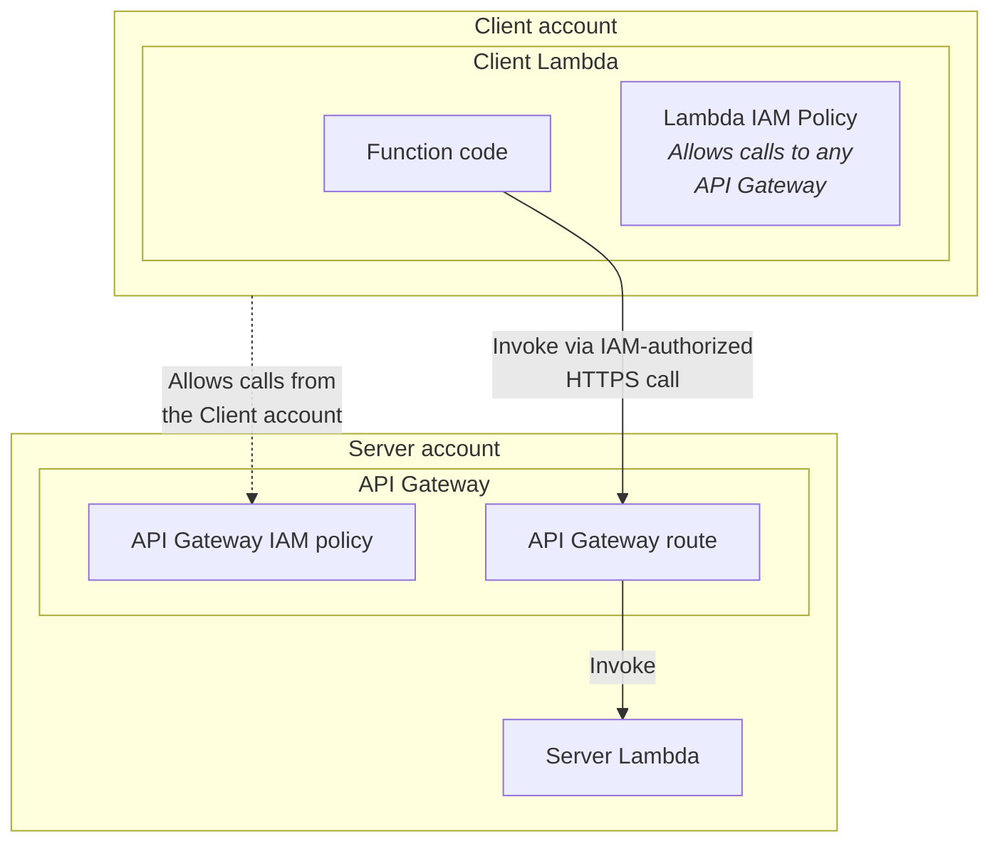

# kiwi-blog-0002-cdk-lambda-auth-api-gw

This example shows how to:

1. Create an API Gateway with
   an [IAM-authorized](https://docs.aws.amazon.com/apigateway/latest/developerguide/api-gateway-control-access-using-iam-policies-to-invoke-api.html)
   route that forwards the request to an internal [Lambda function](./lib/lambda/server.ts).
2. Create a [client Lambda](./lib/lambda/client.ts) function in a **different account**, which will be able to access
   the authorized route.

## Important files

* CDK entrypoint: [bin/app.ts](bin/app.ts)
* Server
    * [lib/stacks/server-stack.ts](lib/stacks/server-stack.ts): contains the API Gateway definition, the
      IAM-authorized route, and the Server Lambda resource definition.
    * [lib/lambda/server.ts](lib/lambda/server.ts): contains the Server Lambda function code, which is just an "echo"
      function that wraps the client's provided `name` and returns a greeting.
* Client
    * [lib/stacks/client-stack.ts](lib/stacks/client-stack.ts): contains the Client Lambda resource definition.
    * [lib/lambda/client.ts](lib/lambda/client.ts): contains the Client Lambda function code, which makes an
      IAM-authorized request to the Server API Gateway.

## Architecture



## Usage

### Server stack

First, assume the AWS credentials for the account where you want to deploy the Server stack. Then, run:

```shell
npm install

# If you are authorizing a single account
npm run cdk:deploy -- -c component=server -c clientAccountId=123456789012

# If you are authorizing the entire organization
npm run cdk:deploy -- -c component=server -c organizationId=o-myorgid
```

Take note of the `ServerGatewayUrl` and `ServerGatewayRegion` outputs, which you will need to use in the next step.

### Client stack

First, assume the AWS credentials for the account where you want to deploy the Client stack. Then, run:

```shell
# Replace https://my-gw-url with the ServerGatewayUrl output value and
# replace my-region with the ServerGatewayRegion output value
npm run cdk:deploy -- -c component=client -c "serverGatewayUrl=https://my-gw-url" -c serverGatewayRegion=my-region
```

Take note of the `ClientLambdaFunctionName` output value.

### Testing

First, assume the AWS credentials for the account where you deployed the **Client stack**.

To validate that the Client Lambda can perform calls to the Server Lambda, via an IAM-authorized API Gateway route,
you can run:

```shell
aws lambda invoke --function-name kiwi-blog-0002-cdk-lambda-auth-api-gw-client-client-lambda lambda-response.json; cat lambda-response.json
```

The output should then be:

```
{                                                                                                        
    "StatusCode": 200,
    "ExecutedVersion": "$LATEST"
}

{"request":{"name":"Mario"},"response":"Hello Mario!"}
```

#### Possible errors

> `An error occurred (ResourceNotFoundException) when calling the Invoke operation`

Make sure to be using the value of the `ClientLambdaFunctionName` output for the `--function-name` argument. This can
happen if you modified the code of the example prior to its deployment.

> User: ...kiwi-blog-0002-cdk-lambda-auth-api-gw-client-client-lambda is not authorized to perform:
> execute-api:Invoke on resource: arn:aws:execute-api:us-east-1:.../prod/POST/my-lambda"}}

Make sure you have provided the right combination of:

* `clientAccountId` or `organizationId` in the Server stack
* `serverGatewayUrl` and `serverGatewayRegion` in the Client stack

### Destroy

Assume the AWS credentials for the account where you deployed the Server stack. Then, run:

```shell
npm run cdk:destroy -- -c component=server -c clientAccountId=x
```

Assume the AWS credentials for the account where you deployed the Client stack. Then, run:

```shell
npm run cdk:destroy -- -c component=client -c serverGatewayUrl=x -c serverGatewayRegion=x
```