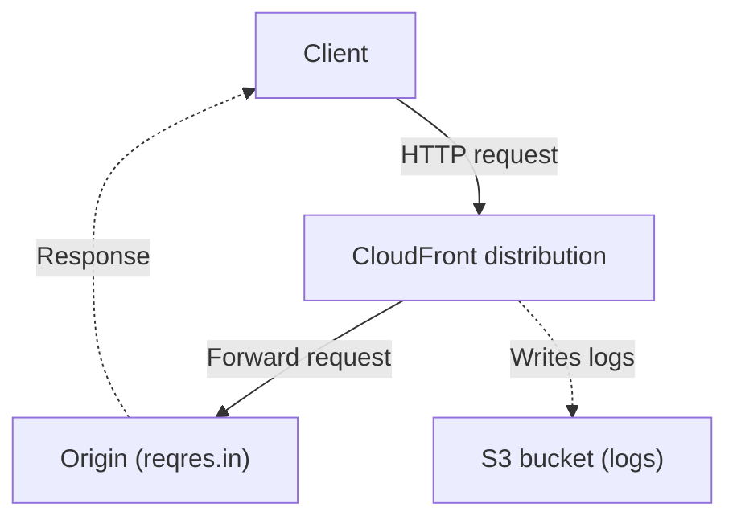
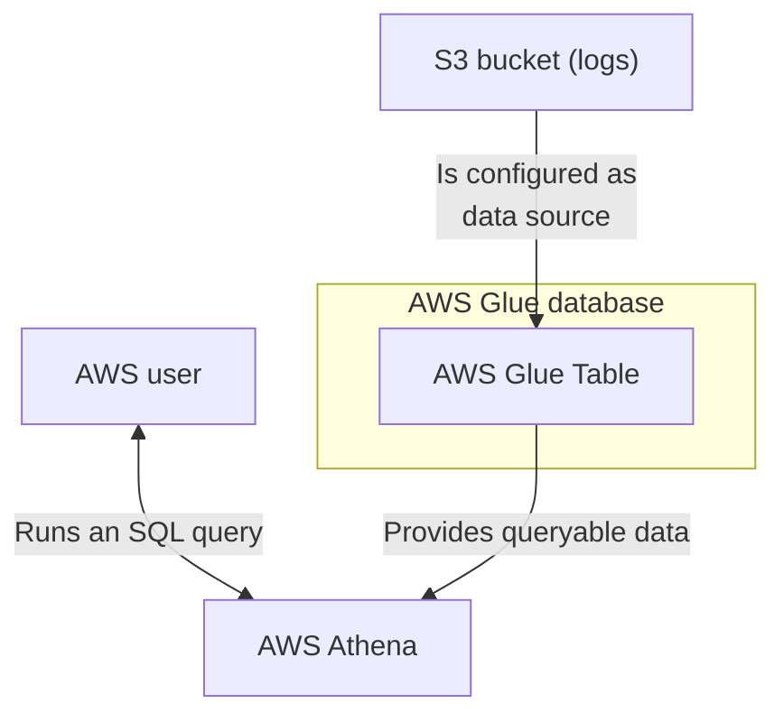

# kiwi-blog-0004-cloudfront-logs-glue-athena

This example shows how to query CloudFront logs using AWS Athena and AWS Glue.

You can find the relative blog post at: https://blog.infra.kiwi/aws-cdk-querying-cloudfront-logs-in-aws-athena-d0c25e1356bf

The data flow on the CloudFormation side of things is:



The data flow on the AWS Athena side of things is:



## Important files

* CDK entrypoint: [bin/app.ts](bin/app.ts)
* Example stack: [lib/stack.ts](lib/stack.ts)

## Usage

Run:

```shell
npm install
npm run cdk:deploy
```

Take note of the various outputs:

* The `DistributionDomainName` output contains the domain name of the CloudFront distribution (e.g. `xxxxxxxxx.cloudfront.net`)
* The `GlueDatabase` output contains the name of the AWS Glue database.
* The `CloudFrontLogsTableName` output contains the name of the AWS Glue table.

You can now open the domain in your browser, and click here and there, or also make a request using cURL:

```shell
# Replace xxxxxxxxx.cloudfront.net with the value of 
# the DistributionDomainName output
curl "https://xxxxxxxxx.cloudfront.net/api/users?page=2"
```

Then proceed to the [AWS Athena query editor](https://us-east-1.console.aws.amazon.com/athena/home?region=us-east-1#/query-editor)
page and execute the following query:

```sql
SELECT *
FROM "kiwi-blog-0004-cloudfront-logs-glue-athena-database"."kiwi-blog-0004-cloudfront-logs-glue-athena-cloudfrontlogstable"
limit 10;
```

**NOTE:** If you have modified the example's code, ensure you are using the right database/table names. The format needs to be:

```sql
FROM "value_of_the_GlueDatabase_output"."value_of_the_CloudFrontLogsTableName_output"
```

You should now be able to see the CloudFront logs and the previous requests you just made!

Then, you can destroy the deployed infrastructure with:

```shell
npm run cdk:destroy
```

## Useful commands

### CDK commands

```shell
# Performs a CDK diff against the current deployed environment
npm run cdk:diff

# Runs the CDK deployment
npm run cdk:deploy

# Destroys all the CDK deployment resources
npm run cdk:destroy

# Shows the synthesized CloudFormation template
npm run cdk:synth
```

### JS commands

```shell
# Run tests
npm run test

# Run lint
npm run lint
```
