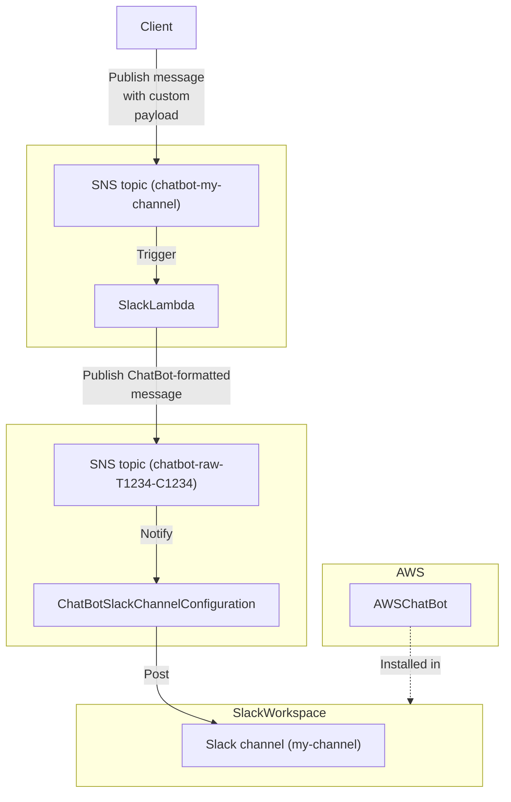

# kiwi-blog-0008-cdk-aws-chatbot

This example shows how to configure the AWS ChatBot to send messages to Slack by creating a notification pipeline that
accepts a custom message payload format.

You can find the relative blog post
at: https://blog.infra.kiwi/aws-cdk-a-slack-notification-pipeline-via-aws-chatbot-0e0c76e7f4c3

## Architecture



## Important files

* The ChatBot/Slack channel
  construct: [lib/constructs/chatbot-slack-channel.ts](lib/constructs/chatbot-slack-channel.ts)
* The Post-To-Slack construct: [lib/constructs/post-to-slack.ts](lib/constructs/post-to-slack.ts)
* The SNS-message-processing Lambda function: [lib/lambda/process-message.ts](lib/lambda/process-message.ts)
* CDK entrypoint: [bin/app.ts](bin/app.ts)
* Example stack: [lib/stack.ts](lib/stack.ts)
* Lambda tests: [test/lambda/process-message.test.ts](test/lambda/process-message.test.ts)

## Usage

Please refer to the blog post for the whole Slack setup procedure. Once you have configured the AWS ChatBot for your
Slack workspace, you can proceed.

Copy the [`config.example.yml`](./config.example.yml) file to a new `config.yml` file and change the configuration of
the notification channel to match your Slack workspace/channel IDs. You can also add any other channels you want!

Then, run the following commands:

```shell
npm install
npm run cdk:deploy
```

Note the value of the `PostToSlackSlackLambdaXXXXXXTopicArn` outputs (where `XXXXXX` is the name of the channel you chose).

You can now verify the deployment by replacing the SNS topic ARN with the output's value in the
following commands:

```
aws sns publish --subject "Hello world!" --message "What a pretty day 🌻" --topic-arn "arn:aws:...:chatbot-my-channel"
aws sns publish --message '{"title":"Hello world!","body":"What a pretty day 🌻"}' --topic-arn "arn:aws:...:chatbot-my-channel"
```

Then, you can destroy the deployed infrastructure with:

```shell
npm run cdk:destroy:all
```

## Useful commands

### CDK commands

```shell
# Performs a CDK diff against the current deployed environment
npm run cdk:diff

# Runs the CDK deployment
npm run cdk:deploy:all

# Destroys all the CDK deployment resources
npm run cdk:destroy:all

# Shows the synthesized CloudFormation template
npm run cdk:synth
```

### JS commands

```shell
# Run tests
npm run test

# Run lint
npm run lint
```
