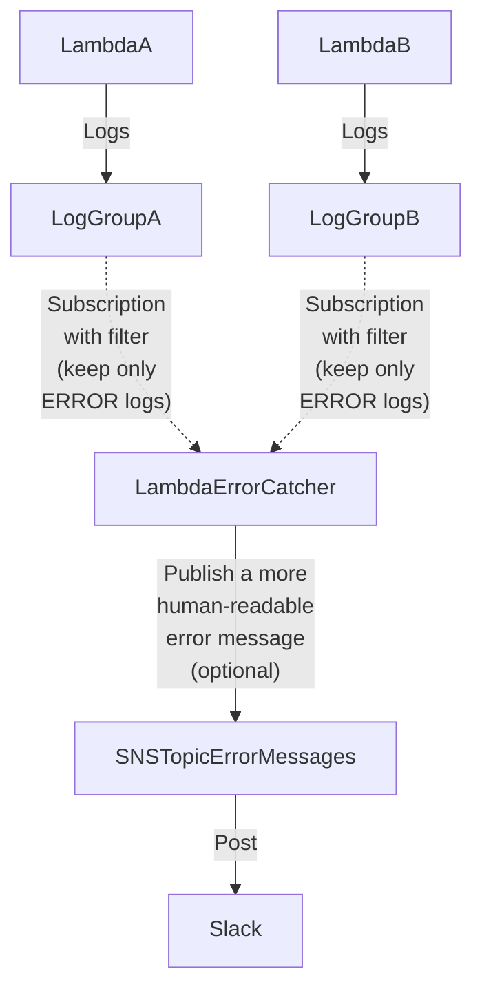

# kiwi-blog-0009-cdk-lambda-error-catcher

This example shows you how you can catch Lambda function error messages and (optionally) post them to a Slack channel.

You can find the relative blog post
at: https://blog.infra.kiwi/aws-cdk-error-catching-for-lambda-functions-092d5d7ed6e7

## Important files

* Error-catcher Lambda function: [lib/lambda/error-catcher.ts](lib/lambda/error-catcher.ts)
* Error-catcher Lambda construct and `registerErrorCatcher`
  function: [lib/constructs/error-catcher-lambda.ts](lib/constructs/error-catcher-lambda.ts)
* Test Lambda function (generates errors at will): [lib/lambda/test.ts](lib/lambda/test.ts)
* CDK entrypoint: [bin/app.ts](bin/app.ts)
* Example stack: [lib/stack.ts](lib/stack.ts)

## Architecture



## Usage

**Note:** this project makes optionally use of the post-to-Slack pipeline created in
the [0008-cdk-aws-chatbot](../0008-cdk-aws-chatbot) example.
If you want to receive Slack notifications, make sure to configure the AWS ChatBot as shown in
the [related blog post](https://blog.infra.kiwi/aws-cdk-a-slack-notification-pipeline-via-aws-chatbot-0e0c76e7f4c3).

Run:

```shell
npm install

# If you are just experimenting with error catching and don't need Slack notifications, run
npm run cdk:deploy

# Or, if you have configured a ChatBot SNS topic via
# https://blog.infra.kiwi/aws-cdk-a-slack-notification-pipeline-via-aws-chatbot-0e0c76e7f4c3#83e6
# Replace the arn:aws:sns:us-east-1:123456789012:chatbot-infra-alerts ARN with your ChatBot custom-payload SNS topic
npm run cdk:deploy -- -c errorCatcherSNSTopicArn=arn:aws:sns:us-east-1:123456789012:chatbot-infra-alerts
```

Take note of the `ErrorCatcherLambdaLogGroupName` output value.

You can then trigger some errors with:

```shell
aws lambda invoke --function-name kiwi-blog-0009-cdk-lambda-error-catchertest-lambda-text --payload 'eyJmYWlsIjp0cnVlfQo=' lambda-response.json; cat lambda-response.json
aws lambda invoke --function-name kiwi-blog-0009-cdk-lambda-error-catchertest-lambda-json --payload 'eyJmYWlsIjp0cnVlfQo=' lambda-response.json; cat lambda-response.json
```

Now, if you configured the Slack pipeline, you should have received some notifications!

Otherwise, you can take a look at the logs of the error-catcher Lambda function using the [AWS Console](https://console.aws.amazon.com/cloudwatch/home#logsV2:log-groups).
There, you want to look for the following log group:

```shell
/aws/lambda/kiwi-blog-0009-cdk-lambda-error-catcher-ErrorCatcherLambda-Catch
```

By inspecting the logs, you should then be able to find entries such as:

```
2024-05-05T04:01:12.213Z	a3075dde-c39c-4925-85cc-069049e9d388	INFO	Received error event: {
  messageType: 'DATA_MESSAGE',
  owner: '123456789012',
  logGroup: '/aws/lambda/kiwi-blog-0009-cdk-lambda-error-catchertest-lambda-text',
  logStream: '2024/05/05/[$LATEST]e59ce634231b420186b0d0efe0a861c5',
  subscriptionFilters: [
    'kiwi-blog-0009-cdk-lambda-error-catcher-TestLambdaTextLogsTestLambdaTextLogsLogGroupErrorCatcher16FAC8E8-Fe1MdTEkqIKg'
  ],
  logEvents: [
    {
      id: '38243138986549603193146005041943076438134586004340998145',
      timestamp: 1714881661850,
      message: '2024-05-05T04:01:01.850Z\t501c51ae-75b0-4231-a51c-9fa99b57b5de\tERROR\tInvoke Error \t{"errorType":"Error","errorMessage":"This error was thrown!","stack":["Error: This error was thrown!","    at Runtime.handler (/var/task/index.js:28:11)","    at Runtime.handleOnceNonStreaming (file:///var/runtime/index.mjs:1173:29)"]}\n'
    }
  ]
}
```

Then, you can destroy the deployed infrastructure with:

```shell
npm run cdk:destroy:all
```

## Useful commands

### CDK commands

```shell
# Performs a CDK diff against the current deployed environment
npm run cdk:diff

# Runs the CDK deployment
npm run cdk:deploy:all

# Destroys all the CDK deployment resources
npm run cdk:destroy:all

# Shows the synthesized CloudFormation template
npm run cdk:synth
```

### JS commands

```shell
# Run tests
npm run test

# Run lint
npm run lint
```
